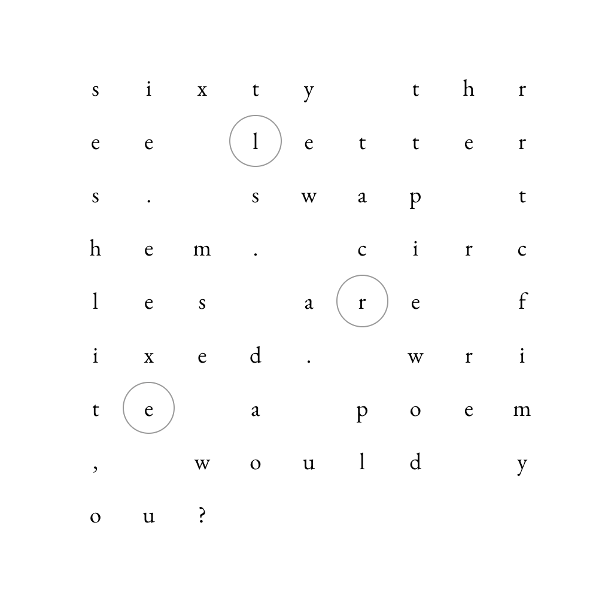

# [63letters](https://63letters.com)

a daily poem puzzle




[play now](https://63letters.com)

## what

sixty three letters. eighteen spaces. three anchors. one grid.

each day brings new letters. swap them around. write a poem.

## how

- visit the site
- see the instructions
- click to begin
- swap letters (but not the circled ones)
- make words
- share your creation (current state of letters is encoded in the url)

## technical

each date generates its own unique set of letters deterministically. urls encode grid state, making poems shareable while preventing cross-date cheating.

built with next.js, typescript, and love for constraints.

deployed on cloudflare workers.

## run locally

```bash
npm install
npm run dev
```

## deploy

```bash
npm run deploy
```